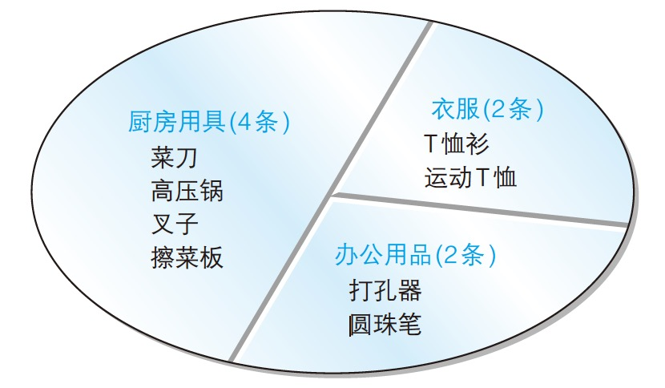

# 聚合
- 聚合：将多行汇总成一行
- 聚合函数 - 用于汇总的函数
    - `COUNT`
    - `SUM`
    - `AVG`
    - `MAX`
    - `MIN`
- **除 `COUNT` 外的聚合函数会把 `NULL` 数据排除在外且不能使用 `*`**
- `SUM`, `AVG` 只适用于数值类型的列，`MAX`, `MIN` 原则上可以适用于任何数据类型的列
- 聚合函数的参数中使用 `DISTINCT` 可以删除重复数据
- 只有 `SELECT` 子句，`HAVING` 子句，和 `ORDER BY` 子句中能够使用聚合函数
- 计算行数

    ```sql
    -- 全部行数（包括 `NULL`）
    SELECT COUNT(*)
      FROM Product;

    -- `purchase_price` 列非空行数
    SELECT COUNT(purchase_price)
      FROM Product;
    ```

    - `COUNT(*)` 会得到包括 `NULL` 在内的数据行数；`COUNT(<列名>)` 会得到该列的除 `NULL` 之外的数据行数
- 求和

    ```sql
    SELECT SUM(sale_price), SUM(purchase_price)
      FROM Product;
    ```

    - `NULL` 数据在求和之前已被剔除
- 求平均

    ```sql
    SELECT AVG(sale_price), AVG(purchase_price)
      FROM Product;
    ```

- 最值

    ```sql
    SELECT MAX(sale_price), MIN(purchase_price)
      FROM Product;

    SELECT MAX(regist_date), MIN(regist_date)
      FROM Product;
    ```

- 删除重复值

    ```sql
    SELECT COUNT(DISTINCT product_type)
      FROM Product;
    ```

    - `DISTINCT` 要在括号中
# 分组（`GROUP BY` 字句）

```sql
SELECT <列名1>, <列名2>, <列名3>, ...
  FROM <表名>
 GROUP BY <列名1>, <列名2>, <列名3>, ...;
```



```sql
SELECT product_type, COUNT(*)
  FROM Product
 GROUP BY product_type;
```

- `GROUP BY` 子句中指定的列称为**聚合键**或者分组列
- `GROUP BY` 子句可以通过逗号分隔指定多列
- `GROUP BY` 子句一定要写在 `FROM` 语句之后；如果有 `WHERE` 子句则要写在 `WHERE` 子句之后

    ```sql
    SELECT purchase_price, COUNT(*)
    FROM Product
    WHERE product_type = '衣服'
    GROUP BY purchase_price;
    ```

- 聚合键中包含 `NULL` 

    ```sql
    SELECT purchase_price, COUNT(*)
    FROM Product
    GROUP BY purchase_price;
    ```

    - 聚合键中包含 `NULL` 时，也会将 `NULL` 作为一组特定数据，在结果中会以“不确定”行（空行）的形式表现出来
- 使用聚合函数时 `SELECT` 子句中只能存在以下三种元素
    1. 常数
    2. 聚合函数
    3. `GROUP BY` 子句中指定的列名（即聚合键）
    - > 通过某个聚合键将表分组之后，结果中的一行数据就代表一组。使用进货单价将表进行分组之后，一行就代表了一个进货单价。但是聚合键和商品名并不一定是一对一的。例如，进货单价是 2800 日元的商品有“运动 T 恤”和“菜刀”两种，没有规则可以决定 2800 日元这一行应该与那个商品对应
- `GROUP BY` 子句中不能使用 `SELECT` 子句中定义的别名
    - `SELECT` 子句在 `GROUP BY` 子句之后执行，在执行 `GROUP BY` 子句时，`SELECT` 子句中定义的别名 DBMS 还并不知道
- `GROUP BY` 子句的结果是随机排序的
- `DISTINCT` 和 `GROUP BY` 能够实现相同的功能，都会把 `NULL` 作为一个独立的结果返回，对多列使用时也会得到完全相同的结果，执行速度也相当（都是数据的内部处理，都是通过排序处理来实现）

    ```sql
    SELECT purchase_price, product_type
      FROM Product
     GROUP BY purchase_price, product_type;

    SELECT DISTINCT purchase_price, product_type
      FROM Product;
    ```

    - 选择的标准是“想要删除选择结果中的重复记录”时使用 `DISTINCT`，在“想要计算汇总结果”时使用 `GROUP BY`
        - 不使用 `COUNT` 等聚合函数而只使用 `GROUP BY` 子句的 `SELECT` 语句，会让人觉得非常奇怪，使人产生“到底为什么要对表进行分组呢？这样做有何必要？”等疑问