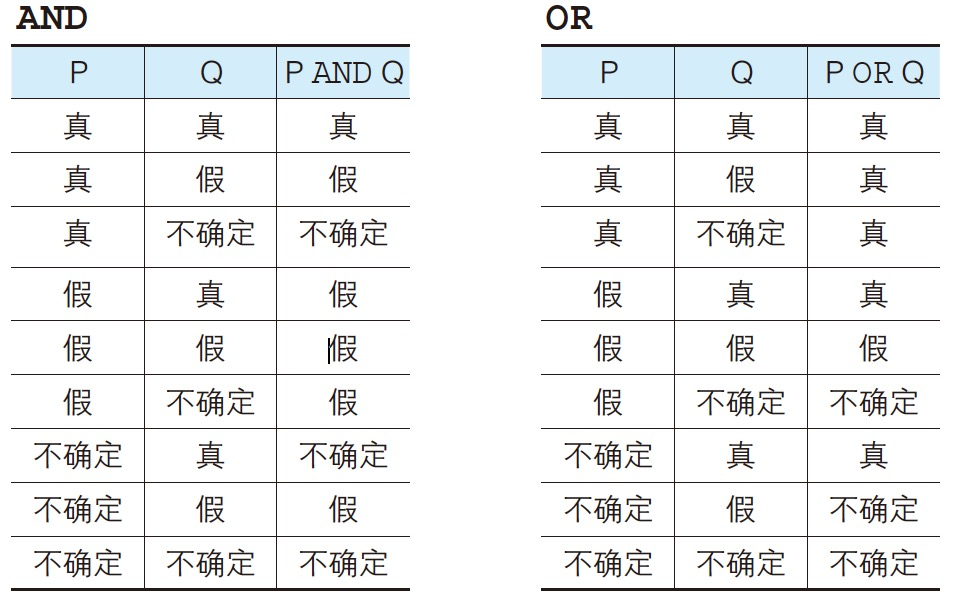

- 算数运算符：`+`, `-`, `*`, `/`
- 比较运算符：`=`, `<>`, `>`, `>=`, `<`, `<=`
    - 最好不用使用 `!=` 替代 `<>`
- 逻辑运算符：`NOT`, `AND`, `OR`
- 使用计算表达式

    ```sql
    SELECT product_name, sale_price,
           sale_price * 2 AS "sale_price_x2"
      FROM Product;
    ```

    - 加法运算符（`+`）前后如果是数字或者数字类型的列名，就会返回加法运算后的结果
- 运算以**行**为单位执行
- **所有包含 `NULL` 的计算，结果肯定是 `NULL`**
    - `NULL / 0` 不会报错，结果仍为 `NULL`；`5/0` 会报错
- 比较运算符可以对字符、数字和日期等几乎所有数据类型的列和值进行比较

    ```sql
    -- 登记日期在 2009年9月27日 之前的记录
    SELECT product_name, product_type, regist_date
      FROM Product
     WHERE regist_date < '2009-09-27';
    ```

- 可以使用比较运算符对计算结果进行比较

    ```sql
    SELECT product_name, sale_price, purchase_price
      FROM Product
     WHERE sale_price - purchase_price >= 500;
    ```

- 比较字符串

    ```sql
    CREATE TABLE Chars
    (chr CHAR(3) NOT NULL,
    PRIMARY KEY (chr));

    BEGIN TRANSACTION;
    INSERT INTO Chars VALUES ('1');
    INSERT INTO Chars VALUES ('2');
    INSERT INTO Chars VALUES ('3');
    INSERT INTO Chars VALUES ('10');
    INSERT INTO Chars VALUES ('11');
    INSERT INTO Chars VALUES ('222');
    COMMIT;

    SELECT chr
      FROM Chars
     WHERE chr > '2';
    ```

    - 以相同字符开头的字符串比不同字符开头的字符串更相近
- 对 `NULL` 使用比较运算符不能得到预期结果（不会抛错），用 `IS NULL` 和 `IS NOT NULL`

    ```sql
    SELECT product_name, purchase_price
      FROM Product
     WHERE purchase_price IS NULL;
    ```

- `NOT` 不能单独使用
- `AND` 运算符优先级高于 `OR` 运算符
- 真值：值为真（`TRUE`）或假（`FALSE`）或不确定（`UNKNOWN`）
    -（真为非零正数，假为 0）`AND` 逻辑积，`OR` 逻辑和
    
- 习题 2.4

    ```sql
    SELECT product_name, product_type, sale_price * 0.9 - purchase_price AS profit
      FROM Product 
     WHERE sale_price * 0.9 - purchase_price > 100 AND (product_type = '办公用品' OR product_type = '厨房用具');
    ```