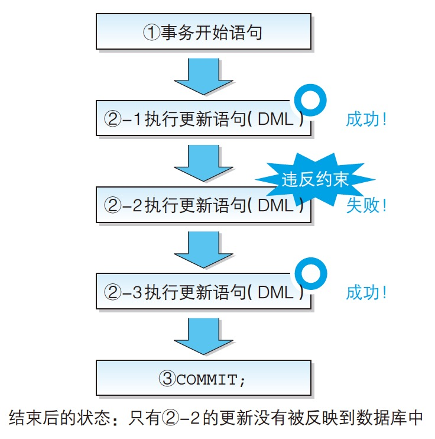

- 数据的更新（`INSERT`, `DELETE`, `UPDATE`）是以 **记录（行）** 为基本单位进行
# `INSERT`

```sql
-- `DEFAULT <默认值>`
CREATE TABLE ProductIns
(product_id CHAR(4) NOT NULL,
 product_name VARCHAR(100) NOT NULL,
 product_type VARCHAR(32) NOT NULL,
 sale_price INTEGER DEFAULT 0,
 purchase_price INTEGER ,
 regist_date DATE ,
 PRIMARY KEY (product_id));
```

- `INSERT`

    ```sql
    INSERT INTO <表名> (列1, 列2, 列3, ...) VALUES (值1, 值2, 值3, ...);
    ```

- 插入一条数据

    ```sql
    INSERT INTO ProductIns (product_id, product_name, product_type, sale_price, purchase_price, regist_date) VALUES ('0001', 'T恤衫', '衣服', 1000, 500, '2009-09-20');
    ```

    - 将列名和值用逗号隔开，分别括在 `()` 内，这种形式称为**清单**（列清单，值清单）
- 对表进行全列 `INSERT` 时，可以省略表名后的列清单，`VALUES` 子句的值会默认按照从左到右的顺序赋给每一列
	
    ```sql
    -- 省略列清单
    INSERT INTO ProductIns VALUES ('0005', '高压锅', '厨房用具', 6800, 5000, '2009-01-15');
    ```

- 原则上，执行一次 `INSERT` 语句会插入一行数据
    - 很多 RDBMS 都支持一次插入多行数据，这样的功能称为多行 `INSERT`（multi row INSERT）

        ```sql
        -- 通常的 INSERT
        INSERT INTO ProductIns VALUES ('0002', '打孔器', '办公用品', 500, 320, '2009-09-11');
        INSERT INTO ProductIns VALUES ('0003', '运动T恤', '衣服', 4000, 2800, NULL);
        INSERT INTO ProductIns VALUES ('0004', '菜刀', '厨房用具', 3000, 2800, '2009-09-20');

        -- 多行 INSERT（Oracle以外）
        INSERT INTO ProductIns VALUES ('0002', '打孔器', '办公用品', 500, 320, '2009-09-11'),
        ('0003', '运动T恤', '衣服', 4000, 2800, NULL),
        ('0004', '菜刀', '厨房用具', 3000, 2800, '2009-09-20');

        -- Oracle 中的多行 INSERT
        INSERT ALL INTO ProductIns VALUES ('0002', '打孔器', '办公用品', 500, 320, '2009-09-11')
                   INTO ProductIns VALUES ('0003', '运动T恤', '衣服', 4000, 2800, NULL)
                   INTO ProductIns VALUES ('0004', '菜刀', '厨房用具', 3000, 2800, '2009-09-20')
        SELECT * FROM DUAL;
        ```

        - `DUAL` 是 Oracle 特有（安装时的必选项）的一种临时表
            - > 在书写没有参照表的 `SELECT` 语句时，写在 `FROM` 子句中的表。它并没有实际意义，也不保存任何数据，同时也不能作为 `INSERT` 和 `UPDATE` 的对象
- `INSERT` 语句中想给某一列赋予 `NULL` 值时，可以直接在 `VALUES` 子句的值清单中写入 `NULL`
    - 想要插入 `NULL` 的列一定不能设置 `NOT NULL` 约束和主键约束，否则 `INSERT` 语句会出错，导致数据插入失败，即希望通过该 `INSERT` 语句插入的数据无法正常插入到表中
    - `SQL` 语句执行失败不会对表中的已有数据造成影响
- 默认值的使用方法通常有显式和隐式两种

    ```sql
    -- 显式
    INSERT INTO ProductIns (product_id, product_name, product_type, sale_price, purchase_price, regist_date) VALUES ('0007', '擦菜板', '厨房用具', DEFAULT, 790, '2009-04-28');

    -- 隐式
    -- 列清单和值清单中都省略设定了默认值的列
    INSERT INTO ProductIns (product_id, product_name, product_type, purchase_price, regist_date) VALUES ('0007', '擦菜板', '厨房用具', 790, '2009-04-28');
    ```

- 省略了没有设定默认值的列，该列的值就会被设定为 `NULL`
    - 如果省略的是设置了 `NOT NULL` 约束的列，`INSERT` 语句会出错
- **从其他表复制数据**（`INSERT ... SELECT`）

    ```sql
    CREATE TABLE ProductCopy
    (product_id CHAR(4)         NOT NULL,
     product_name VARCHAR(100)  NOT NULL,
     product_type VARCHAR(32)   NOT NULL,
     sale_price INTEGER         ,
     purchase_price INTEGER     ,
     regist_date DATE           ,
     PRIMARY KEY (product_id));

    -- 将商品表中的数据复制到商品复制表中
    INSERT INTO ProductCopy (product_id, product_name, product_type, sale_price, purchase_price, regist_date)
    SELECT product_id, product_name, product_type, sale_price, purchase_price, regist_date
      FROM Product;
    ```

- `INSERT ... SELECT` 中 `SELECT` 语句也可以使用 `WHERE` 子句或者 `GROUP BY` 子句等

    ```sql
    -- 根据商品种类进行汇总的表；
    CREATE TABLE ProductType
    (product_type VARCHAR(32)       NOT NULL,
     sum_sale_price INTEGER         ,
     sum_purchase_price INTEGER     ,
     PRIMARY KEY (product_type));

    INSERT INTO ProductType (product_type, sum_sale_price, sum_purchase_price)
    SELECT product_type, SUM(sale_price), SUM(purchase_price)
      FROM Product
     GROUP BY product_type;
    ```

    - 指定 `ORDER BY` 子句没有任何意义，因为无法保证表内部记录的排列顺序
# 删除
- `DROP TABLE` 语句可以将表完全删除
- `DELETE` 语句会留下表（容器）而删除表中的全部数据
    - `DELETE FROM <表名>;`
- 清空表

    ```sql
    -- 清空 Product 表
    DELETE FROM Product;
    ```

- `DELETE` 语句的删除对象并不是表或者列，而是记录（行）
- 搜索型 `DELETE`

    ```sql
    DELETE FROM <表名>
     WHERE <条件>;
    ```

- `DELETE` 语句中不能使用 `GROUP BY`、`HAVING` 和 `ORDER BY` 三类子句，只能使用 `WHERE` 子句
    - `GROUP BY` 和 `HAVING` 是从表中选取数据时用来改变抽取数据形式的，而 `ORDER BY` 是用来指定取得结果显示顺序的，因此在删除表中数据时它们都起不到什么作用
- 标准 SQL 中用来从表中删除数据的只有 `DELETE` 语句。很多数据库产品中还存在另外一种被称为 `TRUNCATE` 的语句
    - OracleSQLServer, PostgreSQL, MySQL, DB2
- `TRUNCATE` (舍弃)

    ```sql
    TRUNCATE <表名>;
    ```

    - `TRUNCATE` 只能删除表中的全部数据，而不能通过 `WHERE` 子句指定条件来删除部分数据
    - 因为它不能具体地控制删除对象，其处理速度比 `DELETE` 快得多
    - 实际上，`DELETE` 语句在 DML 语句中也属于处理时间比较长的，因此需要删除全部数据行时，使用 `TRUNCATE` 可以缩短执行时间
    - > 在 Oracle 中把 `TRUNCATE` 定义为 DDL 而非 DML，因此，Oracle 中的 `TRUNCATE` 不能使用 `ROLLBACK`，执行 `TRUNCATE` 的同时会默认执行 `COMMIT` 操作
# `UPDATE`
- `UPDATE`

    ```sql
    UPDATE <表名>
      SET <列名> = <表达式>;
    ```

    - 更新对象的列和更新后的值都记述在 `SET` 子句
- 更新全部行的登记日期

    ```sql
    UPDATE Product
      SET regist_date = '2009-10-10';
    ```

- 指定条件的 `UPDATE` 语句（搜索型 `UPDATE`）

    ```sql
    UPDATE <表名>
      SET <列名> = <表达式>
     WHERE <条件>;
    ```

```sql
UPDATE Product
  SET sale_price = sale_price * 10
 WHERE product_type = '厨房用具';
```

- 将列更新为 `NULL`（`NULL` 清空）
	
    ```sql
    UPDATE Product
      SET regist_date = NULL
     WHERE product_id = '0008';
    ```

    - `UPDATE` 语句可以将 `NULL` 作为一个值来使用
    - 只有未设置 `NOT NULL` 约束和主键约束的列才可以清空为 `NULL`
- 多列更新

    ```sql
    -- 使用逗号对列进行分隔排列
    UPDATE Product
      SET sale_price = sale_price * 10,
           purchase_price = purchase_price / 2
     WHERE product_type = '厨房用具';

    -- 将列用 () 括起来的清单形式
    UPDATE Product
      SET (sale_price, purchase_price) = (sale_price * 10, purchase_price / 2)
     WHERE product_type = '厨房用具';
    ```

    - 第一种方法在所有的 DBMS 中都可以使用，第二种方法在某些 DBMS 中无法使用（可以在 PostgreSQL 和 DB2 中使用）
# 事务
- 事务（transaction）指需要在同一个处理单元中执行的一系列**更新**处理的集合
- 使用事务开始语句和事务结束语句，将一系列 DML 语句（`INSERT`/`UPDATE`/`DELETE` 语句）括起来，就实现了一个事务处理

    ```sql
    事务开始语句;
    DML 语句 1;
    DML 语句 2;
    DML 语句 3;
    ...
    事务结束语句（COMMIT 或者 ROLLBACK）;
    ```

- 事务开始语句

    ```sql
    -- SQL Server, PostgreSQL
    BEGIN TRANSACTION

    -- MySQL
    START TRANSACTION

    -- Oracle, DB2 (标准 SQL 中规定了一种悄悄开始事务处理的方法)
    无
    ```

- `COMMIT` 是提交事务包含的全部更新处理的结束指令，相当于文件处理中的覆盖保存，一旦提交，就无法恢复到事务开始前的状态
    - 由于误操作提交了包含错误更新的事务，只能重新建表、重新插入数据
- `ROLLBACK` 是取消事务包含的全部更新处理的结束指令，相当于文件处理中的放弃保存，一旦回滚，数据库就会恢复到事务开始之前的状态
## 开始事务
- 事务没有标准的开始指令存在，而是根据 DBMS 的不同而不同
- 几乎所有的数据库产品的事务都无需开始指令，因为大部分情况下，事务在数据库连接建立时就已经悄悄开始了，不需要用户再明确发出开始指令
    - 例如，使用 Oracle 时，数据库连接建立之后，第一条 SQL 语句执行的同时，事务就已经悄悄开始
- 区分事务的两种情况
    1. 每条 SQL 语句就是一个事务（自动提交模式）
        - 该模式下的 DML 语句每一条语句都括在事务的开始语句和结束语句之中
        - 默认使用自动提交模式的 DBMS 有 SQL Server, PostgreSQL 和 MySQL 等
    2. 直到用户执行 `COMMIT` 或者 `ROLLBACK` 为止算作一个事务
        - Oracle 中，事务都是直到用户自己执行提交或者回滚指令才会结束
- 如果不是自动提交，即使使用 `DELETE` 语句删除了数据表，也可以通过 `ROLLBACK` 命令取消该事务的处理，恢复表中的数据；若在自动提交模式下执行 `DELETE`，则无法回滚
## ACID
- DBMS 的事务都遵循 ACID 四种特性
    1. 原子性（Atomicity）
        - 指在事务结束时，其中所包含的更新处理要么全部执行，要么完全不执行，即要么占有一切要么一无所有
    2. 一致性（Consistency）
        - 指事务中包含的处理要满足数据库提前设置的约束，如主键约束或者 `NOT NULL` 约束
        - 对事务来说，其中的**不合法的 SQL 会被回滚**，即对应的 SQL 处理会被取消，不会执行；**其它的合法操作会更新数据库**
        
    3. 隔离性（Isolation）
        - 指保证不同事务之间互不干扰的特性
        - 保证了事务之间不会互相嵌套
        - 在某个事务中进行的更改，在该事务结束之前，对其他事务不可见
    4. 持久性（Durability）
        - 指事务（不论提交还是回滚）结束后，DBMS 能够保证该时间点的数据状态会被保存的特性，即使由于系统故障导致数据丢失，数据库也一定能通过某种手段进行恢复
        - 如果不能保证持久性，即使是正常提交结束的事务，一旦发生了系统故障，也会导致数据丢失，一切都需要从头再来
        - 保证持久性的方法有多种实现，最常见的是将事务的执行记录保存到硬盘等存储介质中（该执行记录称为日志）。当发生故障时，可以通过日志恢复到故障发生前的状态
# 练习题 
- 4.1

    ```sql
    -- Operator A
    CREATE TABLE Product1
        (product_id      CHAR(4)      NOT NULL,
        product_name    VARCHAR(100) NOT NULL,
        product_type    VARCHAR(32)  NOT NULL,
        sale_price      INTEGER ,
        purchase_price  INTEGER ,
        regist_date     DATE ,
        PRIMARY KEY (product_id));

    BEGIN TRANSACTION;
    INSERT INTO Product1 VALUES ('0001', 'T恤衫', '衣服', 1000, 500, '2008-09-20');
    INSERT INTO Product1 VALUES ('0002', '打孔器', '办公用品', 500, 320, '2008-09-11');
    INSERT INTO Product1 VALUES ('0003', '运动T恤', '衣服', 4000, 2800, NULL);
    -- 隔离性：A 执行下列语句会得到 3 条记录；其它用户执行下列语句得到 0 条记录
    SELECT * FROM Product1;
    ```

